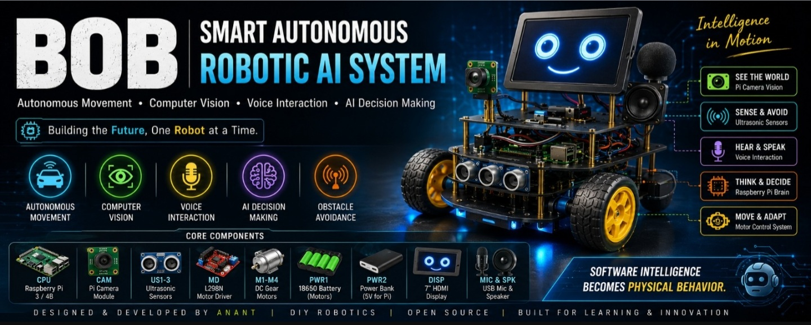
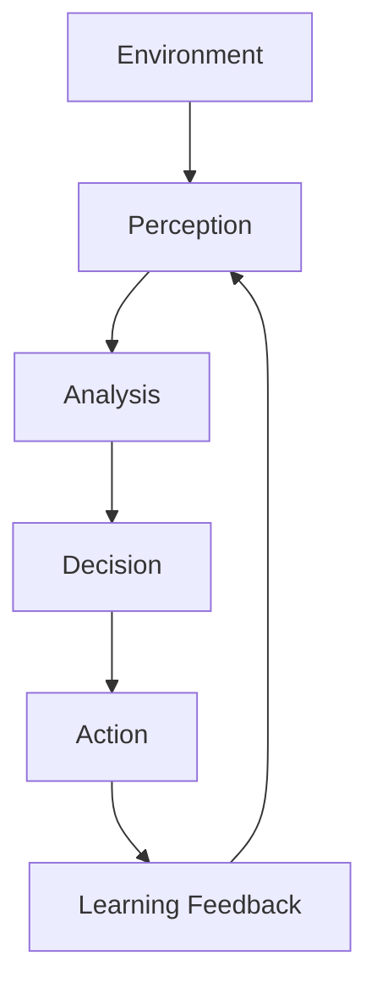
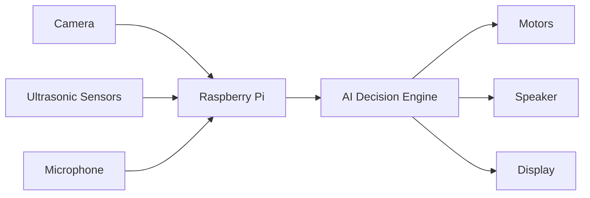

# BOB-Smart-Autonomous-Robotic-AI-System 

### "Where Artificial Intelligence Meets Physical Reality"

BOB is an intelligent autonomous robotic platform designed to perceive its environment, analyze information, make decisions, and perform actions without direct human intervention.

---

##  Project Mission

The vision behind BOB was to create a machine capable of bridging the gap between digital intelligence and physical-world interaction.

Unlike traditional robots that simply follow programmed instructions, BOB is designed to observe, think, decide and respond dynamically.

---

##  Intelligence Cycle

---
##  Core Capabilities

###  Intelligent Vision
Real-time environmental understanding using computer vision.

###  Natural Voice Communication
Human-machine interaction through speech recognition and audio responses.

###  Autonomous Navigation
Independent movement with obstacle awareness and route adaptation.

###  AI Decision Engine
Processes sensory information and selects appropriate actions.

---
##  System Architecture

---
##  System Design Philosophy

BOB was developed using a modular architecture where every subsystem operates independently while remaining connected to the central intelligence engine.

This design allows future integration of:

- Generative AI
- Cloud Computing
- IoT Connectivity
- Reinforcement Learning
- Mobile App Control

---

##  Technology Stack

| Layer | Technology |
|---------|---------|
| Intelligence | Python |
| Vision | OpenCV |
| Processing | Raspberry Pi |
| Communication | Voice Recognition |
| Navigation | Ultrasonic Sensors |
| Control | GPIO Interface |

---

##  Development Team

- Laiba Khan
- Aliza Afzal
- Ayesha Nadeem
- Aqsa Afzal
- Maryam Maqsood
- Tuba Saleem
- Nayyar
- Agha Johar (Team Lead)
- Ammar
- Abdul Wahab
- Ahmad Hassan
- Abdul Raffay

---

##  Academic Supervisors

Professor Ahmad Uzair

Professor Abubakar Riaz

---

##  Future Vision

The long-term objective of BOB is to evolve into a fully intelligent robotic assistant capable of understanding human intentions, adapting to changing environments, and making autonomous decisions in real-world scenarios.

---

##  Project Statement

"Artificial Intelligence becomes truly powerful when it leaves the screen and begins interacting with the real world."
